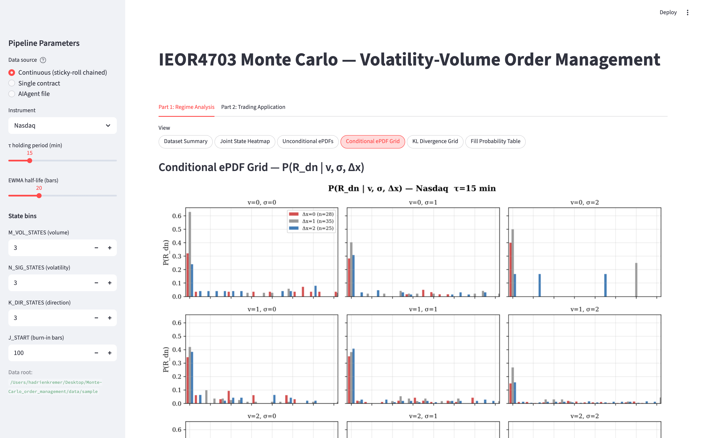
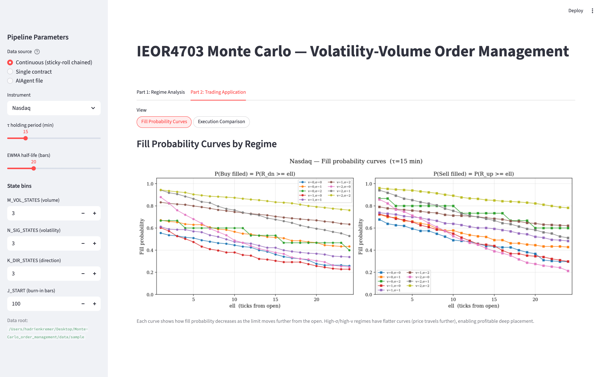
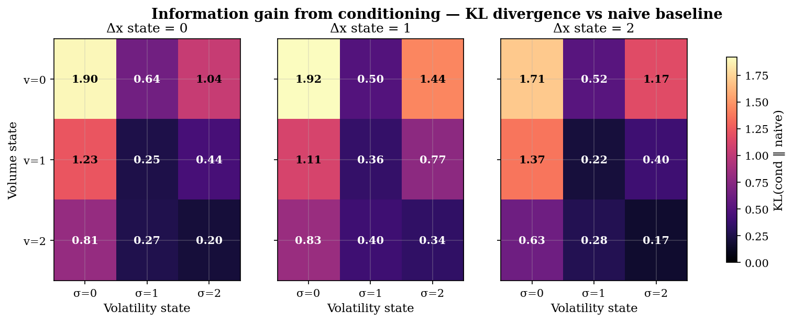
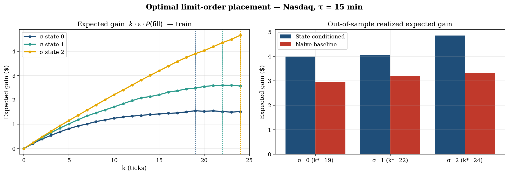
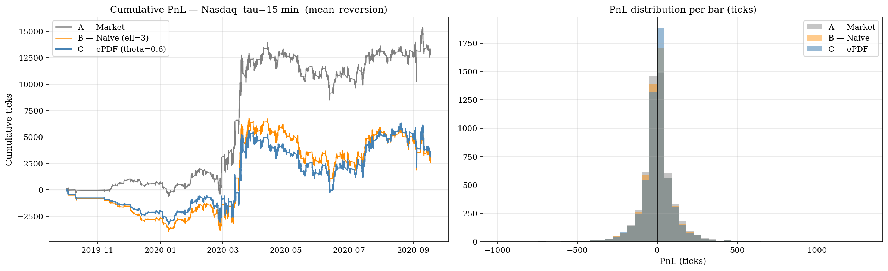

# IEOR4703 Monte Carlo — Volatility-Volume Order Management

**Columbia University — IEOR4703 Monte Carlo Simulation Methods (Hirsa), Spring 2026**
**Term Project 2**

Authors: Cem Okutan, Hadrien Kremer

This project builds and evaluates a state-conditioned empirical PDF (ePDF) framework for intraday limit-order execution. The core idea: the probability that a limit order placed $\ell$ ticks from the bar open gets filled depends on the current volatility, volume, and prior-direction regime. By conditioning on these regimes, the model can choose a placement offset $\ell^*$ that is better-calibrated than a fixed naive offset.

The implementation is a Streamlit dashboard split into two parts — regime analysis and execution comparison — backed by strictly walk-forward (no look-ahead) estimation.

<p align="center">
  
  <br>
  
  <br>
  <em>Streamlit dashboard — Tab 1 (regime analysis) and Tab 2 (execution comparison).</em>
</p>

---

## What it does

### Part 1 — Regime Analysis

**Data pipeline.**  Futures contracts are chained via a sticky-roll rule: the active contract switches to the next one only after its daily volume has exceeded the incumbent's volume for at least 3 consecutive days, preventing the oscillation that `idxmax()` roll produces. The chained 1-minute OHLCV series is resampled to a τ-minute bar series and filtered to regular trading hours (per-market RTH windows in `config.MARKETS`). A day-completeness filter (default: 90 % of expected bars) drops partial sessions.

**Features.** At each bar $j$, three EWMA-based features are computed causally using Algorithm 1 from the project brief:

$$\hat{\mu}_j = \frac{\sum_{i<j} \lambda^{j-i} x_i}{\sum_{i<j} \lambda^{j-i}}, \qquad \hat{\sigma}_j = \sqrt{\frac{\sum_{i<j} \lambda^{j-i}(x_i - \hat{\mu}_j)^2}{\sum_{i<j} \lambda^{j-i}}}$$

The three features are EWMA volume ($\hat{\mu}^{\text{vol}}$), EWMV of tick-range ($\hat{\sigma}^{\text{rng}}$), and EWMA open-to-open return ($\hat{\mu}^{\text{ret}}$). Each is binned into $M$, $N$, and $K$ discrete states using causal quantile boundaries — boundaries are derived from $\{x_0, \ldots, x_{j-1}\}$ only, so no future data leaks into the state assignment at bar $j$.

**Conditional ePDF.**  `build_rolling_epdfs` walks forward bar-by-bar. Before bar $j$ is processed, it records the current conditional fill-probability estimates:

$$P(R_{\text{dn}} \geq \ell \mid v = m,\, \sigma = n,\, \Delta x = k), \quad \ell = 1, \ldots, 10$$

for the state triple $(m, n, k)$ observed at bar $j$. It then updates the running count tables with bar $j$'s realized ranges. The resulting `bt` DataFrame contains one row per bar (from burn-in bar `J_START` onward) with columns `fp_rdn_1`…`fp_rdn_10` and `fp_rup_1`…`fp_rup_10` — strictly out-of-sample fill-probability snapshots.

**Dashboard views (Tab 1):**
- Dataset summary (date range, bar counts)
- Joint state occupancy heatmap (volume × volatility)
- Unconditional ePDFs of $R$, $R_{\text{up}}$, $R_{\text{dn}}$
- Conditional ePDF grid: $3 \times 3$ panels over $(v, \sigma)$ with $\Delta x$ overlaid
- KL divergence grid: $\mathrm{KL}(P_{m,n,k} \,\|\, P_{\text{naive}})$ per cell, showing where regime conditioning adds information
- Fill-probability table: $P(R_{\text{dn}} \geq k)$ for selected $k$ across all state cells vs. naive baseline

### Part 2 — Execution Comparison

Given a directional signal (buy or sell) at each τ-bar, three execution policies are compared on the same set of signal bars:

| Method | Description |
|--------|-------------|
| **A — Market** | Fill at bar open; exit at bar close. Baseline. |
| **B — Naive limit** | Place limit at fixed offset $\ell_B$ ticks from open. If price never reaches the limit, fall back to a market-at-close fill with a 0.5-tick penalty. |
| **C — ePDF-guided** | Choose $\ell^* = \max\{\ell : P(\text{fill} \mid \text{state}) \geq \theta\}$ where $\theta$ is `MIN_FILL_PROB`. If no $\ell \geq 1$ clears the threshold, skip the bar (PnL = 0). If placed but missed, same 0.5-tick fallback as Method B. |

Method C's objective is the largest feasible offset, not expected-gain maximization. The threshold $\theta$ controls the trade-off between placement aggressiveness and fill rate.

**Three signal sources** are available:
- *EWMA mean reversion*: signal = $-\text{sign}(\hat{\mu}^{\text{ret}})$, betting on a reversal of the recent EWMA trend.
- *EWMA trend following*: signal = $+\text{sign}(\hat{\mu}^{\text{ret}})$, betting continuation.
- *AIAgent trades*: direction reconstructed from $\Delta(\text{net\_pos})$ in the per-market AIAgent CSV. A change in net position determines buy (+) or sell (−).

The EWMA signals are placeholder proxies; the project's contribution is the execution layer, not the signal. The AIAgent signal uses an external trade sequence, allowing the execution policies to be evaluated on a realistic set of trade events.

**Walk-forward guarantee on the AIAgent path.** Method C on the AIAgent signal path reads fill probabilities exclusively from the pre-computed per-bar columns in `bt` (`fp_rdn_1`…`fp_rdn_10`). The `MAX_OFFSET` parameter is capped at 10 on this path to prevent any fallback to the final frozen ePDF tables, which would incorporate future data. This ensures that the fill probability used to set $\ell^*$ at a bar in, say, February 2020 reflects only the ePDF state as of that bar.

### OOS Calibration (Tab 1, AIAgent mode)

When the data source is set to "AIAgent file", Tab 1 shows a calibration view. The frozen final ePDFs (built from the full continuous contract history) are evaluated against the AIAgent's realized fill outcomes. For each $(v, \sigma, \Delta x)$ state and each $\ell \in \{1,\ldots,6\}$, the predicted $P(\text{fill})$ is compared to the empirical fill rate on the AIAgent bars. A well-calibrated model should produce scatter points near the $y = x$ diagonal in the calibration plot. This is a diagnostic for convergence, not a trading evaluation — it intentionally uses the final frozen tables.

---

## Repository layout

```
monte-carlo-app/
├── app.py                    # Streamlit dashboard (entry point)
├── config.py                 # Global parameters, MARKETS, AIAGENT_FILENAME, DATA_ROOT resolver
├── data.py                   # load_contract, sticky_roll, load_instrument, resample_ohlcv, apply_rth_filter
├── features.py               # compute_ranges, ewma_ewmv, quantile_states_causal, add_states
├── epdf.py                   # epdf_from_array, fill_prob_from_pmf, kl_div, ConditionalEPDF, build_rolling_epdfs, full_cond_epdf
├── pipeline.py               # prepare_market (single-call wrapper over data + features + epdf)
├── mc_helpers.py             # Backward-compat shim: re-exports everything from the above modules
├── analysis.py               # Stand-alone analysis script (extracted from notebook __main__ block)
├── monte_carlo_project.ipynb  # Original Jupyter notebook
├── requirements.txt
├── data/                     # Futures data (see Data layout below)
└── figures/                  # Output PDFs and PNGs written by analysis.py
```

`mc_helpers.py` exists purely for backward compatibility with the notebook. New imports should target the source modules directly (`config`, `data`, `features`, `epdf`, `pipeline`).

---

## Setup

```bash
python -m venv venv
source venv/bin/activate        # Windows: venv\Scripts\activate
pip install -r requirements.txt
```

Core dependencies (pinned in `requirements.txt`): `streamlit==1.57.0`, `pandas==3.0.3`, `numpy==2.4.6`, `matplotlib==3.10.9`, `scipy==1.17.1`.

---

## Data layout

> **Bundled sample.** Only a truncated **Nasdaq** sample ships with the repo,
> under `data/sample/Nasdaq/` (the three NQ contracts truncated to the first
> ~40k 1-min bars each, plus the full AIAgent CSV — ~10 MB total). It is enough
> to run the Nasdaq pipeline end-to-end out of the box. The full multi-market,
> multi-year dataset is not included; point `MC_DATA_ROOT` at it to reproduce the
> figures in `figures/`.

The application expects one subfolder per instrument, each containing per-contract 1-minute OHLCV CSVs and an optional AIAgent CSV:

```
data/
├── Nasdaq/
│   ├── NQH20.csv          # per-contract 1-min OHLCV, no header
│   ├── NQM20.csv          # columns: timestamp, open, high, low, close, volume
│   ├── NQU20.csv          # timestamp format: YYYY.MM.DD.HH:MM:SS
│   └── AIAgent_Nasdaq.csv
├── Gold/
│   ├── GCG24.csv
│   └── AIAgent_Gold.csv
├── German Bunds - German Government Bonds/
│   └── AIAgent_Bunds.csv
├── EuroStoxx/
│   └── AIAgent_EuroStoxx.csv
├── GBP - British Pound/
│   └── AIAgent_GBPUSD.csv
├── HeatingOil/
│   └── AIAgent_HeatingOil.csv
└── JPY - Japanese Yen/
    └── AIAgent_JPY.csv
```

**AIAgent filename mapping.** Instrument keys with long names do not map directly to filenames. The mapping is defined in `config.AIAGENT_FILENAME`:

| Instrument key | AIAgent filename |
|---|---|
| Nasdaq | `AIAgent_Nasdaq.csv` |
| Gold | `AIAgent_Gold.csv` |
| German Bunds - German Government Bonds | `AIAgent_Bunds.csv` |
| EuroStoxx | `AIAgent_EuroStoxx.csv` |
| GBP - British Pound | `AIAgent_GBPUSD.csv` |
| HeatingOil | `AIAgent_HeatingOil.csv` |
| JPY - Japanese Yen | `AIAgent_JPY.csv` |

**AIAgent CSV format:** 5 columns (no header) — Excel date serial, hour, minute, price, net position (contracts held). The date serial is decoded via `pd.to_datetime(serial - 2, unit="D", origin="1900-01-01")`.

### DATA_ROOT resolution

`config._resolve_data_root()` tries three locations in order:

1. `$MC_DATA_ROOT` environment variable (if set and path exists)
2. `data/` folder inside the project directory, **if** it holds full instrument
   subfolders (a complete local dataset dropped in by the user)
3. `data/sample/` — the bundled Nasdaq sample shipped with this repo (the
   default, so the pipeline runs out of the box)

If none resolve, a `FileNotFoundError` is raised. The resolved path is displayed
at the bottom of the sidebar. To use a custom path:

```bash
export MC_DATA_ROOT=/path/to/your/data
streamlit run app.py
```

---

## Running

```bash
streamlit run app.py
```

Opens at `http://localhost:8501`.

**Sidebar controls:**

| Control | Range | Default | Effect |
|---------|-------|---------|--------|
| Data source | Continuous / Single contract / AIAgent file | Continuous | How contracts are loaded |
| Instrument | dropdown | Nasdaq | Selects the data subfolder |
| Contract | dropdown | — | Only shown in Single contract mode |
| τ holding period (min) | 5–60 | 15 | Bar resampling frequency |
| EWMA half-life (bars) | 5–60 | 20 | Decay rate for EWMA/EWMV features |
| M_VOL_STATES | 2–5 | 3 | Volume regime bins |
| N_SIG_STATES | 2–5 | 3 | Volatility regime bins |
| K_DIR_STATES | 1–5 | 3 | Prior-direction bins |
| J_START (burn-in bars) | 10–500 | 100 | Bars before ePDF estimates are used |

**Tab 1 — Regime Analysis** shows dataset summary, state heatmap, unconditional ePDFs, conditional ePDF grid, KL divergence grid, and fill-probability table. In AIAgent mode it shows price/position chart, trade summary, and OOS calibration.

**Tab 2 — Trading Application** shows fill-probability curves and the execution comparison. The execution comparison has three additional sliders:

| Control | Range | Default | Effect |
|---------|-------|---------|--------|
| MIN_FILL_PROB (Method C) | 0.40–0.90 | 0.60 | Fill-probability threshold for Method C |
| MAX_OFFSET (Method C, ticks) | 2–10 | 6 | Maximum limit offset Method C considers |
| Fixed offset ℓ (Method B, ticks) | 1–10 | 3 | Fixed offset for Method B |

---

## Design choices

| Parameter | Default | Rationale |
|-----------|---------|-----------|
| `TAU` | 15 min | Coarse enough to accumulate meaningful range; fine enough to capture intraday structure. Matches the paper's primary specification. |
| `HALF_LIFE` | 20 bars | One trading day at τ=15 min. Gives moderate smoothing; recent regimes weight more than a month-old data. |
| `M_VOL_STATES` | 3 | Low / Mid / High volume. Three bins give meaningful separation without sparsity in the count tables. |
| `N_SIG_STATES` | 3 | Low / Mid / High volatility, same rationale as volume states. |
| `K_DIR_STATES` | 3 | Down / Flat / Up prior direction. Captures momentum and mean-reversion asymmetry. |
| `J_START` | 100 bars | Burn-in before ePDF estimates are used; ~8 trading days at τ=15 min. Ensures count tables have enough observations for non-degenerate probabilities. |
| `MIN_BAR_FRAC` | 0.90 | A day with fewer than 90 % of the expected bar count is dropped. Removes half-sessions and data-feed gaps without discarding near-complete days. |
| `MAX_SPREADS` | 150 | Maximum $\ell$ tracked in the ePDF count arrays. Tails beyond 150 ticks are negligible for all supported markets. |
| `MIN_FILL_PROB` (Method C default) | 0.60 | Requires at least 60 % predicted fill probability before placing a limit. Tunable; lower values are more aggressive, higher values trade less. |
| `MAX_OFFSET` (Method C default) | 6 | Upper bound on $\ell^*$; prevents Method C from placing limits far from the open when the ePDF is flat. |
| `ell_fixed` (Method B default) | 3 ticks | Fixed offset for the naive baseline. Three ticks is a reasonable mid-range placement across the supported markets. |

---

## Methodological notes

> **Terminology note.** "Monte Carlo" refers to the course context
> (Columbia IEOR4703 — Monte Carlo Simulation Methods). The method implemented
> here is **empirical conditional-density estimation**, not trajectory
> simulation. We estimate a regime-conditioned empirical PDF of intra-bar price
> ranges, turn it into limit-order fill probabilities, and use those to choose a
> placement offset. The defining properties are that estimation is **strictly
> causal (no look-ahead)** and validated **walk-forward** — every fill
> probability used at bar *j* is built only from data prior to *j*.

**Signal as placeholder.** The EWMA mean-reversion and trend-following signals are synthetic; they are included only to provide a directional input so the three execution methods can be compared on a controlled set of bars. The project's analytical contribution is the execution layer — the decision of *where* to place a limit given a signal, not the signal itself.

**Walk-forward correctness.** `build_rolling_epdfs` updates count tables *after* querying probabilities at each bar. Every entry in the `bt` DataFrame reflects only data prior to that bar. On the AIAgent execution path, Method C reads exclusively from these per-bar `fp_rdn_*`/`fp_rup_*` columns, with `MAX_OFFSET` capped at 10 (the number of pre-computed columns). This prevents any reference to the frozen final ePDF tables, which would embed future observations.

**Method C fallback.** When $P(\text{fill} \mid \text{state}) < \theta$ for all $\ell \geq 1$, Method C skips the bar entirely (PnL = 0, not traded). When a limit is placed but price fails to reach it, Method C falls back to a market-at-close fill with a 0.5-tick penalty — the same rule used by Method B. This penalty is an approximation of half-spread slippage on a market order.

**No price back-adjustment.** Contract rolls introduce a small price discontinuity (the cost-of-carry spread). The data is not back-adjusted because the downstream statistics ($R$, $R_{\text{up}}$, $R_{\text{dn}}$) are intra-bar quantities that are invariant to constant price shifts. The roll bar itself may have an inflated range; it is retained but treated as a noise observation by the ePDF.

**OOS calibration vs. execution evaluation.** The OOS calibration view in Tab 1 intentionally uses the frozen final ePDF tables (all contract history) applied to AIAgent bars. This measures whether the model converges to well-calibrated probabilities over the full training period. It is a diagnostic, not a trading simulation. The execution comparison in Tab 2 uses the walk-forward `bt` probabilities to avoid look-ahead.

---

## Results

All figures below are for **Nasdaq, τ = 15 min**, regenerated by `python analysis.py`.

### Conditioning recovers information vs. a naive baseline


KL divergence between each regime-conditioned fill-probability distribution and
the unconditional naive baseline, per (volume, volatility, prior-direction) cell.
Divergence is largest in low-volume / low-volatility cells and collapses toward
zero in high-volume cells — regime conditioning carries the most information
precisely in the quiet states where naive placement is most miscalibrated.

### State-conditioned placement beats the naive offset out-of-sample


*Left:* expected gain `k · ε · P(fill | state)` as a function of offset `k`, by
volatility state — the gain-maximizing offset `k*` widens with volatility
(`k* = 19, 22, 24` ticks for the low/mid/high volatility states).
*Right:* out-of-sample realized expected gain; the state-conditioned offset
exceeds the naive baseline across all three volatility states (`3.99 vs 2.94`,
`4.04 vs 3.18`, `4.86 vs 3.32`), widest in the high-volatility state.

### Walk-forward execution backtest


Cumulative PnL (ticks) of the three execution policies on the EWMA signal, with
the per-bar PnL distribution on the right. **Caveat:** the EWMA signal here is a
placeholder used to generate controlled directional bars (see *Limitations*) —
this panel demonstrates the walk-forward execution machinery, not a tradable
strategy.

> Numeric values (`k*` per state, OOS realized gains) are taken from
> `figures/tab02_oos_optimal_placement_Nasdaq.csv` and
> `figures/tab01_conditional_fill_probabilities_Nasdaq.csv`, written by
> `analysis.py` on the full continuous contract history.

---

## Limitations & next steps

**Limitations (honest scope).**
- **Signals are placeholders.** The EWMA signals exist only to generate a
  controlled set of directional bars so the three execution policies can be
  compared. The contribution is the *execution layer*, not the signal.
- **No price back-adjustment across rolls.** Harmless for the intra-bar range
  statistics used here (invariant to constant shifts) but would matter for any
  inter-bar return model.
- **Fallback is an approximation.** An unfilled limit falls back to a
  market-at-close fill with a flat 0.5-tick penalty — a stand-in for half-spread
  slippage, not a microstructure-accurate cost model.
- **Single-instrument depth.** The pipeline is fully exercised on Nasdaq; the
  other six markets are less explored.

**Next steps.**
- Replace the placeholder signal with a genuine signal layer and evaluate the
  ePDF placement on top of it.
- Generalize the pipeline cleanly across all seven instruments.
- Add a short reproducible "executive summary" notebook running on `data/sample/`.

